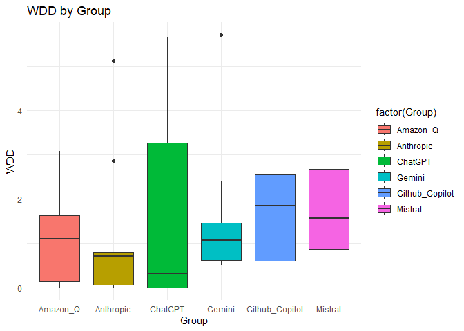
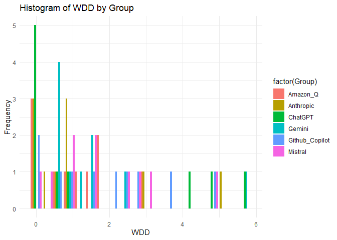

WDD Kruskal-Wallis
================
Daniel Geladin
2025-04-18

``` r
# install.packages("dplyr")
# install.packages("ggplot2")
# install.packages("ggpubr")

data=read.csv("data/WDD.csv")
head(data)
```

    TRUE                Model       WDD
    TRUE 1 Amazon_Q_Developer 0.8823529
    TRUE 2 Amazon_Q_Developer 0.5464481
    TRUE 3 Amazon_Q_Developer 3.0841122
    TRUE 4 Amazon_Q_Developer 1.3207547
    TRUE 5 Amazon_Q_Developer 1.7934783
    TRUE 6 Amazon_Q_Developer 1.5652174

``` r
library(dplyr)
```

    TRUE Warning: package 'dplyr' was built under R version 4.4.3

    TRUE 
    TRUE Attaching package: 'dplyr'

    TRUE The following objects are masked from 'package:stats':
    TRUE 
    TRUE     filter, lag

    TRUE The following objects are masked from 'package:base':
    TRUE 
    TRUE     intersect, setdiff, setequal, union

``` r
library(ggplot2)
```

    TRUE Warning: package 'ggplot2' was built under R version 4.4.3

``` r
library(ggpubr)
```

    TRUE Warning: package 'ggpubr' was built under R version 4.4.3

``` r
clean_data <- na.omit(data)

# Group by Model and run Shapiro-Wilk test on WDD
normality_results <- clean_data %>%
  group_by(Model) %>%
  summarise(
    p_value = shapiro.test(WDD)$p.value,
    .groups = "drop"
  )
normality_results
```

    TRUE # A tibble: 6 × 2
    TRUE   Model               p_value
    TRUE   <chr>                 <dbl>
    TRUE 1 Amazon_Q_Developer 0.280   
    TRUE 2 Anthropic_Claude   0.000988
    TRUE 3 ChatGPT            0.00163 
    TRUE 4 Gemini             0.000478
    TRUE 5 Github_Copilot     0.580   
    TRUE 6 Mistral            0.712

``` r
#pval greater than 0.05, assumes normality. Anything lower than 0.05 can NOT assume normality. 

clean_data <- clean_data %>%
  mutate(log_WDD = log1p(WDD))  # log(1 + WDD)

# Check normality for each model
normality_results <- clean_data %>%
  group_by(Model) %>%
  summarise(
    p_value = shapiro.test(log_WDD)$p.value,
    .groups = "drop"
  )

data$Group <- ifelse(data$Model == "Amazon_Q_Developer", "Amazon_Q",
                    ifelse(data$Model == "Anthropic_Claude", "Anthropic",
                           ifelse(data$Model == "ChatGPT", "ChatGPT",
                                  ifelse(data$Model == "Gemini", "Gemini",
                                         ifelse(data$Model == "Github_Copilot", "Github_Copilot",
                                                ifelse(data$Model == "Mistral", "Mistral", NA))))))


# Print normality results
print(normality_results)
```

    TRUE # A tibble: 6 × 2
    TRUE   Model              p_value
    TRUE   <chr>                <dbl>
    TRUE 1 Amazon_Q_Developer 0.228  
    TRUE 2 Anthropic_Claude   0.0493 
    TRUE 3 ChatGPT            0.00457
    TRUE 4 Gemini             0.0336 
    TRUE 5 Github_Copilot     0.520  
    TRUE 6 Mistral            0.955

``` r
# Data is not normalized. Running anova to compare against Kruskal-Wallis

#compare (log-transformed) models
anova_result <- aov(log_WDD ~ Model, data = clean_data)
summary(anova_result)
```

    TRUE             Df Sum Sq Mean Sq F value Pr(>F)
    TRUE Model        5  1.129  0.2257   0.633  0.675
    TRUE Residuals   54 19.250  0.3565

``` r
#no significant difference in means between models

#comparing models using a test that doesn't assume normality 
kruskal_result <- kruskal.test(WDD ~ Model, data = clean_data)
kruskal_result
```

    TRUE 
    TRUE    Kruskal-Wallis rank sum test
    TRUE 
    TRUE data:  WDD by Model
    TRUE Kruskal-Wallis chi-squared = 3.9795, df = 5, p-value = 0.5524

``` r
#no significant difference in means between models
```

graphs

``` r
library(ggplot2)
# WDD Boxplot
ggplot(data, aes(x = factor(Group), y = WDD, fill = factor(Group))) +
  geom_boxplot() +
  labs(title = "WDD by Group", x = "Group", y = "WDD") +
  theme_minimal()
```

<!-- -->

``` r
# Histograms for WDD by group
ggplot(data, aes(x = WDD, fill = factor(Group))) +
  geom_histogram(position = "dodge", bins = 20) +
  labs(title = "Histogram of WDD by Group", x = "WDD", y = "Frequency") +
  theme_minimal()
```

<!-- -->
