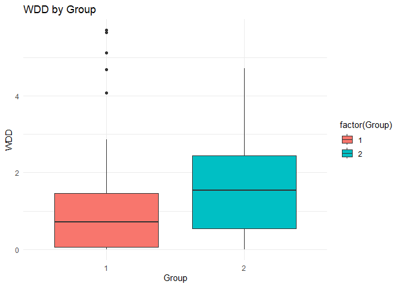
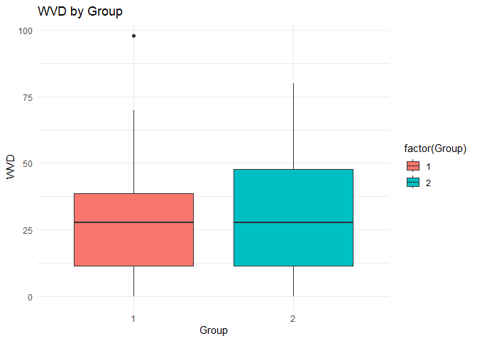
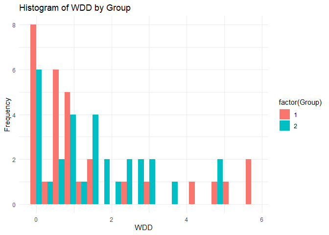
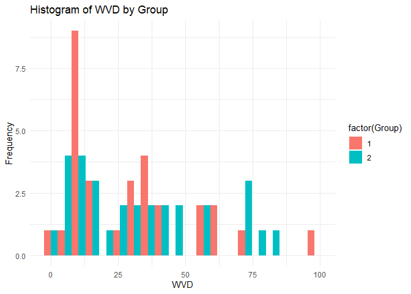

WDD WVD T-Tests
================
Daniel Geladin
2025-04-18

``` r
df=read.csv("data/WDD_WVD.csv")
head(df)
```

                   Model       WDD       WVD
    1 Amazon_Q_Developer 0.8823529  6.588235
    2 Amazon_Q_Developer 0.5464481 74.094718
    3 Amazon_Q_Developer 3.0841122 58.280374
    4 Amazon_Q_Developer 1.3207547 45.566038
    5 Amazon_Q_Developer 1.7934783 32.434783
    6 Amazon_Q_Developer 1.5652174 24.130435

``` r
df$Group <- ifelse(df$Model %in% c("Anthropic_Claude", "ChatGPT", "Gemini"), 1, 2)

# Normality tests
shapiro.test(df$WDD[df$Group == 1])
```


        Shapiro-Wilk normality test

    data:  df$WDD[df$Group == 1]
    W = 0.74331, p-value = 7.113e-06

``` r
shapiro.test(df$WDD[df$Group == 2])
```


        Shapiro-Wilk normality test

    data:  df$WDD[df$Group == 2]
    W = 0.92001, p-value = 0.02684

``` r
shapiro.test(df$WVD[df$Group == 1])
```


        Shapiro-Wilk normality test

    data:  df$WVD[df$Group == 1]
    W = 0.8942, p-value = 0.006075

``` r
shapiro.test(df$WVD[df$Group == 2])
```


        Shapiro-Wilk normality test

    data:  df$WVD[df$Group == 2]
    W = 0.91192, p-value = 0.01664

t test (w var.equal to F) is for non-normal data, comparing it to a test
(wilcox test) that assumes normality

``` r
t.test(WDD ~ Group, data = df, var.equal = FALSE)
```


        Welch Two Sample t-test

    data:  WDD by Group
    t = -0.39762, df = 53.791, p-value = 0.6925
    alternative hypothesis: true difference in means between group 1 and group 2 is not equal to 0
    95 percent confidence interval:
     -0.9900562  0.6623667
    sample estimates:
    mean in group 1 mean in group 2 
           1.418432        1.582276 

``` r
t.test(WVD ~ Group, data = df, var.equal = FALSE)
```


        Welch Two Sample t-test

    data:  WVD by Group
    t = -0.36946, df = 57.744, p-value = 0.7131
    alternative hypothesis: true difference in means between group 1 and group 2 is not equal to 0
    95 percent confidence interval:
     -14.80270  10.19019
    sample estimates:
    mean in group 1 mean in group 2 
           30.15881        32.46507 

``` r
wilcox.test(WDD ~ Group, data = df)
```

    Warning in wilcox.test.default(x = DATA[[1L]], y = DATA[[2L]], ...): cannot
    compute exact p-value with ties


        Wilcoxon rank sum test with continuity correction

    data:  WDD by Group
    W = 363, p-value = 0.1981
    alternative hypothesis: true location shift is not equal to 0

``` r
wilcox.test(WVD ~ Group, data = df)
```

    Warning in wilcox.test.default(x = DATA[[1L]], y = DATA[[2L]], ...): cannot
    compute exact p-value with ties


        Wilcoxon rank sum test with continuity correction

    data:  WVD by Group
    W = 429, p-value = 0.7618
    alternative hypothesis: true location shift is not equal to 0

graphs

``` r
library(ggplot2)
```

    Warning: package 'ggplot2' was built under R version 4.4.3

``` r
# WDD Boxplot
ggplot(df, aes(x = factor(Group), y = WDD, fill = factor(Group))) +
  geom_boxplot() +
  labs(title = "WDD by Group", x = "Group", y = "WDD") +
  theme_minimal()
```

<!-- -->

``` r
# WVD Boxplot
ggplot(df, aes(x = factor(Group), y = WVD, fill = factor(Group))) +
  geom_boxplot() +
  labs(title = "WVD by Group", x = "Group", y = "WVD") +
  theme_minimal()
```

<!-- -->

``` r
# Histograms for WDD and WVD by group
ggplot(df, aes(x = WDD, fill = factor(Group))) +
  geom_histogram(position = "dodge", bins = 20) +
  labs(title = "Histogram of WDD by Group", x = "WDD", y = "Frequency") +
  theme_minimal()
```

<!-- -->

``` r
ggplot(df, aes(x = WVD, fill = factor(Group))) +
  geom_histogram(position = "dodge", bins = 20) +
  labs(title = "Histogram of WVD by Group", x = "WVD", y = "Frequency") +
  theme_minimal()
```

<!-- -->
